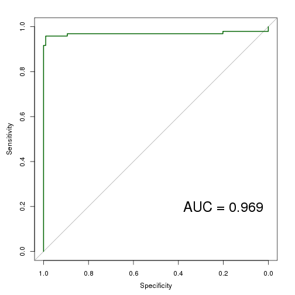
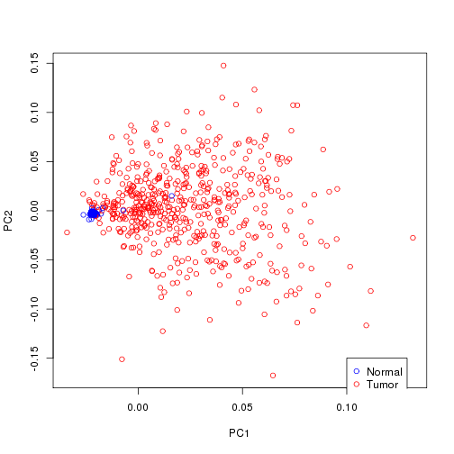

# 2a-RR_test.R

- Scott Funkhouser and Ting Shen
- STT855 LUAD Final Project

## Objective
1. We want to test whether prediction of tissue status - normal or tumor can be done using
	the 18 tumor CNVs identified in TCGA-LUAD paper 2014. And whether prediction accuracy can be
	increased by using all 20K CNV parameters.

### Table of contents
1. [Prediction with candidate CNVs](#prediction-with-candidate-cnvs)
2. [Prediction with all CNVs](#prediction-with-all-cnvs)


```r
setwd("/mnt/home/funkhou9/Project-LUAD/scripts")
library(BGLR)
library(magrittr)
library(pROC)
```

```
## Type 'citation("pROC")' for a citation.
## 
## Attaching package: 'pROC'
## 
## The following objects are masked from 'package:stats':
## 
##     cov, smooth, var
```

Load data from 1-assemble_data.R


```r
load("../data/processed/for_analysis/data_for_analysis.RData")
X <- scale(cnv[, -1])
```

Outcome - binary tumor status.


```r
Y <- cnv[, 1]
Y_masked <- Y
```

Randomly mask 200 outcomes for prediction.


```r
mask <- sample(1:length(Y), size = 200)
Y_masked[mask] <- NA
```

### Prediction with candidate CNVs
Save names from candidate genes with copy number alterations. Identified with GISTIC.


```r
sigcopy <- c("NKX2-1",
			 "TERT",
			 "MDM2",
			 "MCL1",
			 "KRAS",
			 "EGFR",
			 "MET",
			 "TERC",
			 "CCND1",
			 "CCND3",
			 "CDK4",
			 "ERBB2",
			 "CDK3",
			 "ZNF217",
			 "CDKN2A",
			 "PTPRD",
			 "KAT6A",
			 "JAK2")

X_sigcopy <- X[, colnames(X) %in% sigcopy]
```

Check for missing values.


```r
idx <- apply(X_sigcopy, 2,
	  		 function(x) {
	  			any(is.na(x))
	  		 })

X_sigcopy_full <- X_sigcopy[, !idx]
```

Check if any filtering of X is necessary.


```r
apply(X_sigcopy_full, 2, summary)
```

```
##               MCL1      CCND1       KRAS       CDK4       MDM2      ERBB2
## Min.    -1.738e+00 -3.128e+00 -4.270e+00 -2.028e+00 -2.550e+00 -2.811e+00
## 1st Qu. -5.786e-01 -2.449e-01 -1.660e-01 -2.171e-01 -1.859e-01 -2.605e-01
## Median  -5.671e-01 -2.304e-01 -1.518e-01 -2.031e-01 -1.727e-01 -2.413e-01
## Mean     5.501e-18 -1.246e-17 -4.663e-18 -3.441e-18  5.939e-18 -3.961e-18
## 3rd Qu.  3.673e-01 -9.317e-02 -4.856e-02 -8.978e-02 -1.045e-01  4.445e-03
## Max.     6.528e+00  1.393e+01  1.347e+01  1.105e+01  1.106e+01  1.477e+01
##               CDK3     ZNF217       TERC       TERT      CCND3       EGFR
## Min.    -5.680e+00 -3.817e+00 -3.919e+00 -2.612e+00 -2.985e+00 -2.956e+00
## 1st Qu. -3.764e-01 -3.263e-01 -1.780e-01 -5.073e-01 -2.322e-01 -3.644e-01
## Median  -3.510e-01 -3.066e-01 -1.577e-01 -4.933e-01 -2.159e-01 -3.543e-01
## Mean     1.876e-17 -1.366e-17  8.942e-18 -2.786e-17  2.752e-18  2.411e-17
## 3rd Qu.  7.731e-02  1.013e-02 -1.005e-01  1.819e-01 -4.834e-02  3.931e-02
## Max.     7.547e+00  7.249e+00  7.034e+00  7.508e+00  1.208e+01  1.090e+01
##                MET      KAT6A       JAK2      PTPRD     CDKN2A
## Min.    -3.831e+00 -4.645e+00 -5.038e+00 -7.885e+00 -8.081e+00
## 1st Qu. -2.334e-01 -1.077e-01 -1.782e-01 -1.603e-01  1.050e-02
## Median  -2.218e-01 -9.153e-02  3.317e-01  3.802e-01  3.715e-01
## Mean    -1.044e-18 -6.840e-18  8.275e-19 -4.911e-18 -1.620e-17
## 3rd Qu.  7.244e-03 -5.186e-02  3.478e-01  3.961e-01  3.803e-01
## Max.     1.424e+01  9.882e+00  9.766e+00  4.465e+00  2.865e+00
```

Eigenvector decomposition of G derived from X_sigcopy_full.


```r
G <- X_sigcopy_full %*% t(X_sigcopy_full) / ncol(X_sigcopy_full)
evd <- eigen(G)
plot(evd$vector[, 1],
	 evd$vector[, 2],
	 col = c("blue", "red")[(Y == 1) + 1],
	 xlab = "PC1",
	 ylab = "PC2")
legend(0.1,
	   -0.15,
	   pch = c(1, 1),
	   c("Normal", "Tumor"),
	   col = c("blue", "red"))
```

 

Perform RR.


```r
X_sigcopy_full_std <- X_sigcopy_full / sqrt(ncol(X_sigcopy_full))
ETA <- list(cnv = list(X = X_sigcopy_full_std, model = 'BRR'))
```

```r
fm <- BGLR(y = Y_masked,
	   	   ETA = ETA,
	   	   response_type = "ordinal",
	   	   nIter = 10000,
	   	   burnIn = 2000,
	   	   thin = 2,
	   	   saveAt = "../data/processed/for_analysis/posterior/cnv/RR-subset-")
```

Check trace plot of var(b).


```r
cnv_varB <- scan("../data/processed/for_analysis/posterior/cnv/RR-subset-ETA_cnv_varB.dat")
plot(cnv_varB,
	 xlab = "Iteration",
	 ylab = "varB",
	 main = "Trace plot")
```

 

Check prediction accuracy.


```r
plot(fm$yHat[mask],
	 Y[mask],
	 col = c("red", "blue")[(Y[mask] == 1) + 1],
	 xlab = "linear predictor (Xb)",
	 ylab = "tumor status (Y)",
	 main = "Predictions for TST")
```

 

```r
roc <- roc(Y[mask], fm$yHat[mask])
plot(roc,
	 col = "darkgreen")
```

```
## 
## Call:
## roc.default(response = Y[mask], predictor = fm$yHat[mask])
## 
## Data: fm$yHat[mask] in 104 controls (Y[mask] 0) < 96 cases (Y[mask] 1).
## Area under the curve: 0.9694
```

```r
text(0.2, 0.2,
	 paste("AUC = ", round(roc$auc, 3), sep = ''),
	 cex = 2)
```

 

### Prediction with all CNVs
Remove genes with any missing values.


```r
idx <- apply(X, 2, 
	  		 function(x) {
	  			any(is.na(x))
	  		 })
X_full <- X[, !idx]
```

Eigenvector decomposition of G derived from X_full.


```r
G_full <- X_full %*% t(X_full) / ncol(X_full)
evd_full <- eigen(G_full)
plot(evd_full$vector[, 1],
	 evd_full$vector[, 2],
	 col = c("blue", "red")[(Y == 1) + 1],
	 xlab = "PC1",
	 ylab = "PC2")
legend(0.1,
	   -0.15,
	   pch = c(1, 1),
	   c("Normal", "Tumor"),
	   col = c("blue", "red"))
```

 

Set up linear predictor and fit using ridge regression.


```r
ETA <- list(cnv = list(X = X_full, model = 'BRR'))
```

```r
fm_full <- BGLR(y = Y_masked,
	   	   		ETA = ETA,
	   	   		response_type = "ordinal",
	   	   		nIter = 120000,
	   	   		burnIn = 2000,
	   	   		thin = 2,
	   	   		saveAt = "../data/processed/for_analysis/posterior/cnv/RR-")
```

Check trace plot of var(b).


```r
cnv_varB_full <- scan("../data/processed/for_analysis/posterior/cnv/RR-ETA_cnv_varB.dat")
plot(cnv_varB_full,
	 xlab = "Iteration",
	 ylab = "varB",
	 main = "Trace plot")
```

 

Check prediction accuracy.


```r
plot(fm_full$yHat[mask],
	 Y[mask],
	 col = c("red", "blue")[(Y[mask] == 1) + 1],
	 xlab = "linear predictor (Xb)",
	 ylab = "tumor status (Y)",
	 main = "Predictions for TST")
```

 

```r
roc <- roc(Y[mask], fm_full$yHat[mask])
plot(roc,
	 col = "darkgreen")
```

```
## 
## Call:
## roc.default(response = Y[mask], predictor = fm_full$yHat[mask])
## 
## Data: fm_full$yHat[mask] in 104 controls (Y[mask] 0) < 96 cases (Y[mask] 1).
## Area under the curve: 0.9984
```

```r
text(0.2, 0.2,
	 paste("AUC = ", round(roc$auc, 3), sep = ''),
	 cex = 2)
```

 

```r
save.image(file = "../2a-RR_test.RData")
```

