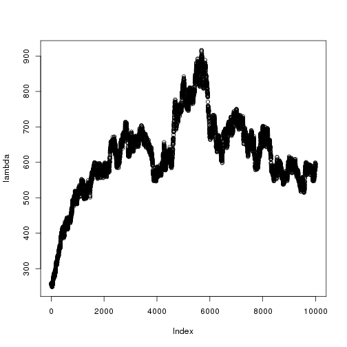

# 2c-RR_RNA_test.R

- Scott Funkhouser and Ting Shen -
- STT855 LUAD Final Project -

## Objective
1. We want to test whether using the RNA seq data with a ridge regression estimator
	can produce a sensitive and specific estimator based on one trail of training and testing.


```r
setwd("/mnt/home/funkhou9/Project-LUAD/scripts")
library(BGLR)
library(magrittr)
library(pROC)
```

```
## Type 'citation("pROC")' for a citation.
## 
## Attaching package: 'pROC'
## 
## The following objects are masked from 'package:stats':
## 
##     cov, smooth, var
```

Load data from 1-assemble_data.R


```r
load("../data/processed/for_analysis/data_for_analysis.RData")
```

### Ridge regression with rna data
Center and scale X.


```r
X <- scale(mrna[, -1])
```

Outcome - binary tumor status.


```r
Y <- mrna[, 1]
```

Randomly mask 200 outcomes for prediction.


```r
mask <- sample(1:length(Y), size = 100)
Y[mask] <- NA
```

Check for missing values.


```r
apply(X, 2, 
	  function(x) {
	  	any(is.na(x))
	  }) %>%
	sum()
```

```
## [1] 332
```

Remove genes with any missing values.


```r
idx <- apply(X, 2, 
	  		 function(x) {
	  			any(is.na(x))
	  		 })
X_full <- X[, !idx]
```

Set up linear predictor and fit using ridge regression.


```r
ETA <- list(mrna = list(X = X_full, model = 'BL'))
```

```r
fm <- BGLR(y = Y,
	   	   ETA = ETA,
	   	   response_type = "ordinal",
	   	   nIter = 20000,
	   	   burnIn = 2000,
	   	   thin = 2,
	   	   saveAt = "../data/processed/for_analysis/posterior/mrna/BL-")
```

```
## Warning in sqrt(post_threshold2 - post_threshold^2): NaNs produced
```

Inspect trace plots.


```r
lambda <- scan("../data/processed/for_analysis/posterior/mrna/BL-ETA_mrna_lambda.dat")
varE <- scan("../data/processed/for_analysis/posterior/cnv/BL-varE.dat")
mu <- scan("../data/processed/for_analysis/posterior/cnv/BL-mu.dat")
thresholds <- scan("../data/processed/for_analysis/posterior/cnv/BL-thresholds.dat")

plot(lambda)
```

 

Check prediction accuracy and determine optimal classification threshold.


```r
plot(fm$yHat[mask],
	 mrna[, 1][mask],
	 xlab = "Preditions",
	 ylab = "Tumor status")
```

 

Check ROC curve


```r
roc <- roc(mrna[, 1][mask], fm$yHat[mask])
plot(roc, col = "green")
```

 

```
## 
## Call:
## roc.default(response = mrna[, 1][mask], predictor = fm$yHat[mask])
## 
## Data: fm$yHat[mask] in 90 controls (mrna[, 1][mask] 0) < 10 cases (mrna[, 1][mask] 1).
## Area under the curve: 1
```

```r
save.image(file = "../2c-RR_RNA_test.RData")
```

